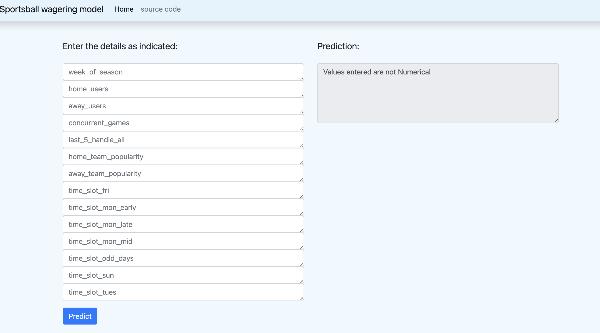

# The Sportsball wagering Challenge 

The primary objective of this project is to deliver a robust forecasting model that furnishes the finance team with real-time predictions for the demand of money wagered, commonly referred to as 'handle,' on sportsball matches.

The ML team has been provided with two sources of data, one being a Postgres database and the other one an API endpoint containing real data from week 11. 

I spent half of my time on model development and the other half on deployment. Below, I have provided information that could help you in underestanding my thoughts process.

## Database 

The data for this project comes from two sources. I was able to access Postgress databse and PGAdmin, however, the provided API refused to authorize my requests. I assume I did not have the necessary credentials. Since I have not seen the documentation regarding the API data, these are my high-level thoughts on merging two datasets. An ETL process can let us integrate two sources into a single dataset for further analysis.

- Data Extraction: Connecting to two sources and using appropriate methods such as sql queries for the enterprise databse and HTTP requests for the API to extract data. All necessary data including both historical and real-time data will be stored in a data lake such as AWS S3.
    - Real_time data: real-time streaming platforms such as Apache Kafka could be used to extract data. This data could be unstructured or semi-structured including Json or other data formats.
    - Enterprise data: batch ETL process could be use to extract such data. We could use Apache Spark batch process to do this. This data is usually structured.
- Data Transformations: Both sources of data must be clean and preprocess to handle missing values, outliers, etc. Schema maping is an important step to merge two sources of data. For instance, map "timestamp" in real-time data to "game_date" in batch data. 
- Merging two datasets: Converting real-time data into structured records let us use the power of SQL queries to easily merge two sources of data
- Load merged data: Finally, the merged data could be stored in a data warehouse such as AWS Redshift. 
- Monitoring: Tracking the health of the ETL proecss and data stored into the data lake is necessary.
- Scheduling: Schedule the ETL process to run on apropriate intervals. In this case, considering the enterprise database, daily.
- Documentation, testing and version control are also important to take care of the ETL process. 


## Model Development

Please check this [EDA.ipynb](notebooks/EDA.ipynb) notebook. I have included so much information regarding data analysis. You can also find different SQL queries to extract data from the database. 

Regarding my model selection, I decided to use a Random Forest Regressor. I ran a set of experiments with different models, however, due to the complexity of the dataset, I focused on models that can capture non-linear realtionship between datapoints and the target output. I tested two different ensemble models. These models use a set of smaller (or weaker) models to create a strong one. In Random Forest for instance, we use a set of decision trees. 

I also trained a neural network model. Neural nets are more complex models compare to other machine learning models, however, a similar performance with the Random Forest model was captured. The r2 score for RandomForestRegressor is %69 while it's %67 for the Neural Net. 

I also tried a XGBoostRegressor model which did not have an acceptable performance compared to the RandomForest model. 

I noticed signs of overfitting while training the model using cross validation technique. This could have been avoided if I had more historical data or features that could capture a better relationship between datapoints and the output.

Working on the query that Dr. Research shared with us grabed my attention towards event based predictions. If I had enough time, I would have tried to train a model on user based predictions. Features such as outcome_decimal_odds, bet_result, payout, etc. could have been used for training a model capable of detecting wager_amount on each event.

## MLOps

MLOps is like the behind-the-scenes magic that helps take your awesome machine learning models from the lab and safely into the real world. A series of MLOps best practices and principles helps us to deploy a model that the finance team could use easily. For this project I used a series of tools that helped me both with model development and deployment. I have used some of these tools before, but some of them were new to me and since this project was so interesting, I decided to challenge myself to measure my skills and push myself to learn some new ones. Originally, I had this idea to use AWS services, however, I decided to use open-source tools listed below:

* Cookiecutter: This provided me with a template for my Machine Learning project structure 
* Data Version Control (DVC): DVC is a data and model versioning tool. It also provides us with creating piplines to develop models and keep track of changes
* Github: For code version control
* Github Actions: For CI/CD jobs
* MLFlow: It serves as a model registry and keep track of all the models that you ran during different experiments. It has a webbased interface that makes it really convinient to keep track of changes. 
* Heroku: It was used for application deployment. 
* Flask: Web application development.
* EvidentlyAI: To evaluate and monitor models in production.
* Pytest: unit tests.

After setting up my private github repo, I implemented the below steps respectivly:

 1. Environment and project structure: Using conda I set up the working enviroment with Python 3.11. Besides, I used Cookiecutter to create a machine learning project structure (see the below image).

    

    This structure includes folder and sub folders such as 'data/external', 'data/raw', 'src/models', etc. Keeping a repo clean and neat to help other developers to underestand your project easier.

2. DVC: In this section, I explain how important it is to use data version control tools as it makes the model development more organized and efficient. There were three tables including 'users.csv', 'events.csv' and 'wagers.csv'. All has been stored to 'data/external'. I used dvc to version all three. 
    ```
    pip install dvc 
    dvc init 
    dvc add data/external/events.csv
    dvc add data/external/wagers.csv
    dvc add data/external/users.csv
    ```
    Now, if you loose your data, using `dvc pull` your data will be retrived. 
    ```
    A data/external/events.csv                                                                                1 file added
    ```
3. Source code: All python scripts related to the project has been stored in the 'src' folder. A yaml file called [params.yaml](params.yaml) has been used to store all the configurations related to this project. 
    * [load_data.py](src/data/load_data.py): This py file connects to the postgres databse to extract raw data using a .sql file that has been stored [here](src/data/data_models/dr.sql).
    * [build_features.py](src/features/build_features.py): It builds a new feature based on [team's popularity](src/features/popularity_score.csv). Plase check [EDA.ipynb](notebooks/EDA.ipynb) for more information on how to calulcate a team's popularity.
    * [process_data.py](src/data/process_data.py): It applies different processing functions to data such as one hot encoding, imputing missing rows, etc.
    * [split_data.py](src/data/split_data.py): Split data to train, test sets.
    * [train_model.py](src/models/train_model.py): This is where we train the models. We can train several models and MLFlow keep track of their performance. We can check the model performance using the mlflow dashboard.
    * [production_model_selection.py](src/models/production_model_selection.py): This script checks all the models and compare them using different metrics such as r2-score. It saves the best model to 'models' folder.

4. Pipeline: DVC was used to write the model pipeline. [dvc.yaml](dvc.yaml) includes multiple stages to load data, create features, process data, train models and select the best model. It also version both the data and model in each stage. the advantage of using dvc is that it only execute a stage if dependencies have changed. 

    To run the pipeline:
    ```
    % mlflow server --backend-store-uri sqlite:///mlflow.db --default-artifact-root ./artifacts --host 0.0.0.0 -p 1234
    % dvc repro
    ```
    If nothing changes:
    ```
    % dvc repro
    Stage 'raw_dataset_creation' didn't change, skipping                                                  
    Stage 'feature_creation' didn't change, skipping                                                                           
    Stage 'process_data' didn't change, skipping                                                                           
    Stage 'split_data' didn't change, skipping                                                                           
    Stage 'model_train' didn't change, skipping                                                                           
    Stage 'log_production_model' didn't change, skipping                                                               
    Data and pipelines are up to date.
    ```

    After running the pipeline, we could check MLFlow dashboard to see different experiments.

    

    

    Here I have done two experiments with different hyper prameters. MLFLow stores both model with the history of training and evaluation results. Later in the pipeline, this information will be used for production model selection.

5. Web app: A simple [web app](app.py) was created using flask. Simply, The objective is to send the response of prediction to the front end after the request. I have used templates for HTML, CSS and Javascript codes. 

    

6. Unit tests: A simple testing was done using [Pytest](tests/test_config.py). It checks whether all entry values are numerical or not. It raises an exception if someone enters a string value instead of a numerical value.

7. Application deployment: Heroku was used to deploy the web app. Using the Github Actions [CI/CD pipeline](.github/workflows/ci-cd.yaml), we can reflect the changes in model or code through the frontend. This becomes really helpul when we plan to retrain the model. It makes the process of deployment much faster and efficient with a single push to the repo.

    

    

8. Production model monitoring: After deploying the model into prod enviroment, the next and one of the important steps is monitoring the performance of the model. Problem such as concept drift can happen and affect the performance of the model. EvidentlyAI uses statistical test such as t-test, chi-squared, etc. to mesasure the drift. It returns the reports as HTML or json files that could be used as trigers for retrainig the model. [model_monitor.py](src/models/model_monitor.py) provides a simple example for comparing train with new unseen data (I just extracted a sample from the same original data). 

    

    These tests suggest that dataset drift was not detected.

    * If I had more time I would do the following to monitor the model's output:
        - Define and log relevant performance metrics such as r2 score. If the value of such metric decress to a certain threshold, I would consider retraining the model.
        - EvidentlyAI is a great tool that could be use as a dashboard for visualization purposes. This makes it easier to detect outliers, data drift, etc.
        - Alerting: I could set up mechanisim based on different metrics and threshold.
        - Scheduled model training.
        - Document and version models and their performance on the data.

## Future Developments

* describe limitations within the data. Considering the goal that was detecting total amount wagered on each event, I faced some limitations regarding the data:

    - Missing data: Even though there were 245 events, we didn't have wager data for all of them. 
    - Data Quantity: Sportsball wagering was recently became available only for 4 out of 12 provinces. This means we are dealing with a small dataset. This also has to be considered that, Sportsball wagering became available through 4 provinces gradually. 
    - Data Drift: As wagering become available through other provinces, there is going to be new trends in the data. This makes it challenging for the model to have a strong performance on new data. the model has to be monitored and retrained.
    - Data Staleness: Old data do not reflect current data as the users in 2018 are only from one province. 
    - Data Collection problems: As mentioned in the challenge, the enterprise database has known quality issues when it comes to accurately calculating total user numbers before an event has occurred.
    - feature limitations: Betting is really dependent on the team's popularity and performance metrics. Lack of such features could downgrade model's performance.

* let us know some features that you think might benefit the analysis. There are so many features that could be used for model training:

    - Team statistics: A team's performance and popularity could be really usefull. historical statistics such as win-loss records, points, etc. are all factors that could affect wagering.
    - Team injuries and line ups: information on injured or key players besides the composition of the starting lineup.
    - Social Media: Sentiment of social media posts or news.
    - Maybe eniromental conditions such as weather!
    - Data on major events such Super Bowl or playoffs.
    - Changes in Betting Regulations.
    - The availability and reach of the game through various broadcasting platforms.

* The MLOps pipeline that I designed is really useful for the current condition which is providing the finance team with a model for predicting wager amounts for the next week, however, as more provinces join Sportsball wagering, we have to scale up. In order to do that it is logical to use cloud services such as AWS. If I had enough time, these are some of the services I would use: 

    - Amazon Kinesis for real time data ingestion at scale.
    - AWS Glue for ETL jobs to transform data and store them into data lakes. 
    - AWS SageMaker for model development and deployment.
    - Lambda functions for scalable inference. 
    - AWS CloudWatch for monitoring and logging.
    - etc.

    More detailed information can be rovided on request.


